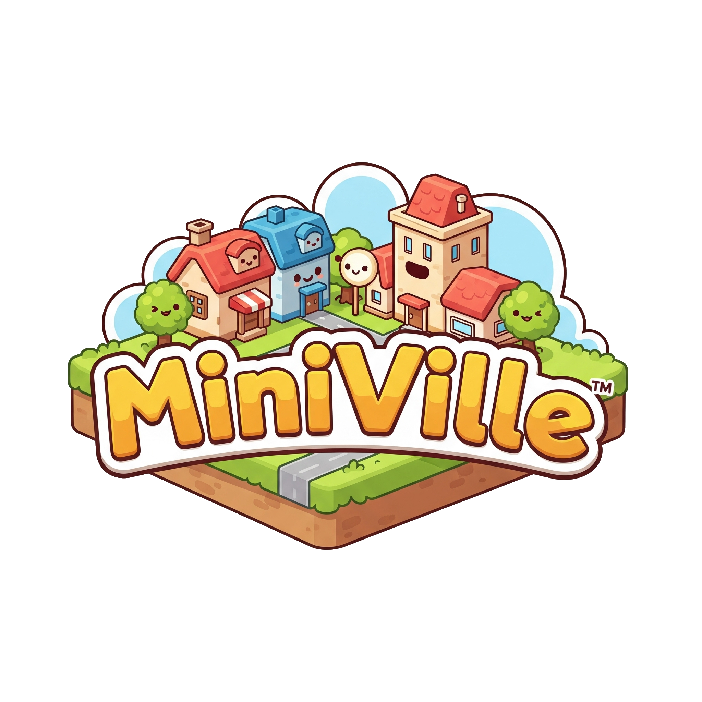
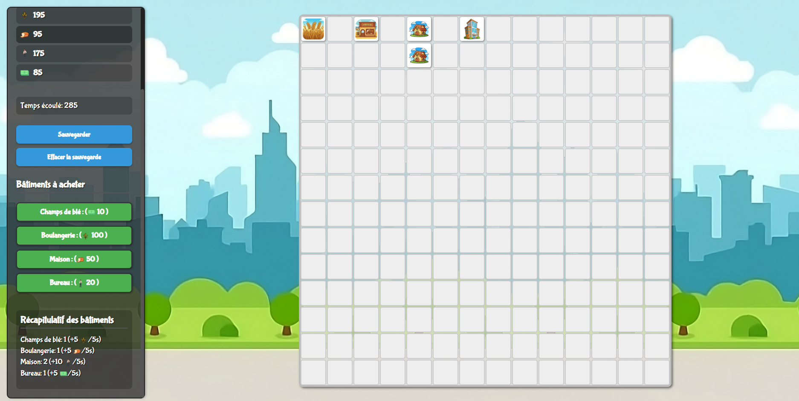
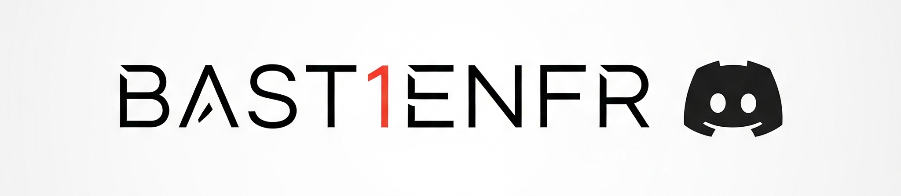

  

# 🏙️ MiniVille

> ⚠️ **Projet personnel en cours de développement**  
> Ce jeu a été créé avant tout pour que je m’amuse à développer. Il peut contenir des bugs ou des fonctionnalités incomplètes.  
> **À noter : il n’y a pas de réel but dans le jeu pour le moment.**

MiniVille est un jeu de gestion de ville minimaliste et accessible, développé en JavaScript, HTML et CSS. Construisez, développez et gérez votre propre cité en optimisant vos ressources !

---

## ✨ Fonctionnalités principales

- **Gestion des ressources** : Gérez le blé, le pain, les habitants et l’argent pour faire évoluer votre ville.
- **Construction stratégique** : Placez différents bâtiments (champs, boulangeries, maisons, bureaux...) pour maximiser la production.
- **Chaînes de production animées** : Visualisez la transformation des ressources à travers des animations fluides.
- **Sauvegarde automatique** : Reprenez votre partie à tout moment grâce à l’enregistrement dans le navigateur.
- **Interface soignée** : Profitez d’une interface moderne et agréable pour une expérience optimale.

---

## 🎮 Comment jouer

1. [Cliquez ici pour jouer en ligne !](https://bast1enfr.github.io/MiniVille-Game/)
2. Utilisez la barre latérale pour acheter et sélectionner des bâtiments.
3. Placez-les sur la grille afin de développer votre ville.
4. Gérez vos ressources et planifiez votre expansion pour atteindre la prospérité !

---

## 🕹️ Contrôles

- **Acheter et placer un bâtiment** :  
  Cliquez sur le bouton d'achat, puis cliquez sur la grille pour placer le bâtiment.  
  Appuyez sur `ECHAP` pour annuler le placement.

- **Déplacer un bâtiment** :  
  Faites un glisser-déposer (drag & drop) du bâtiment sur la grille pour le déplacer.

- **Supprimer un bâtiment** :  
  Cliquez simplement sur un bâtiment pour le supprimer. Vous récupérez la moitié de son prix d'achat.

---

## 🚀 Aperçu

MiniVille vous propose de prendre la tête d’une petite ville et de la faire prospérer à travers une gestion intelligente des ressources et des bâtiments. Sa prise en main rapide et son interface intuitive permettent à tous de s’y essayer !

---

## 📷 Captures d’écran

  

---

## 🛠️ Technologies utilisées

- **HTML5**
- **CSS3**
- **JavaScript (ES6 Modules)**

---

## 🙏 Remerciements & Crédits

- Jeu développé par [Bast1enFR](https://github.com/Bast1enFR)
- Assets générés avec Gemini AI

---

## 📄 Licence

Ce projet est sous 

---

  

